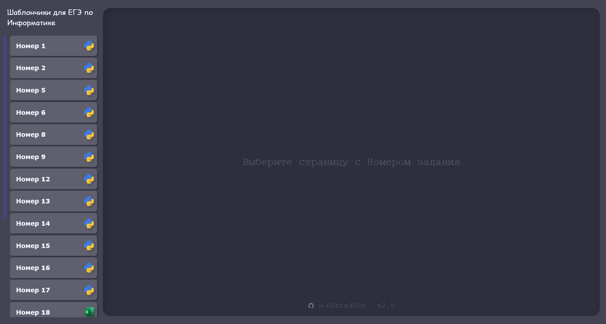

<h1 align="center">
Шаблоны кодов для ЕГЭ по информатике <a href="https://ultrad00d.github.io/">🔗</a>
</h1>

📚 Коллекция шаблонов кодов для решения задач из ЕГЭ по Информатике. Проект включает все задания, где требуется написание кода. 

## ✨ Особенности

- 📚 Покрытие всех заданий, требующих программирования
- 🎨 Интуитивно понятный UI с быстрой навигацией
- 📹 Встроенные ссылки на полезные видеоразборы
- 📱 Адаптивный дизайн (работает на любых устройствах)
- 🔄 Обновление контента через `content.json`

## Как использовать

1. Перейдите на сайт по [ссылке](https://ultrad00d.github.io/)
2. Выберите нужное задание из списка
3. Изучите предложенные варианты решения
4. Практикуйтесь, модифицируйте и запоминайте!

<i>
Желаю, чтобы на экзамене все задачи казались вам знакомыми, чтобы не было параметров с суммой модулей, а в графе Тестовый балл за экзамен по инфе появилась заветная цифра <b> «💯» </b>!
</i>

